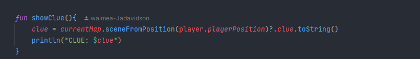
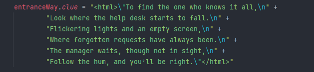
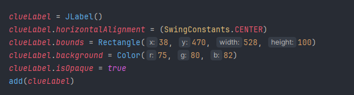
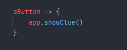
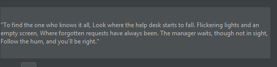
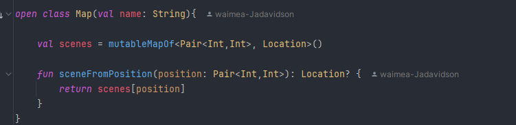
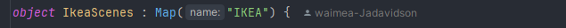
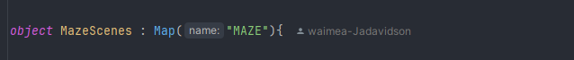
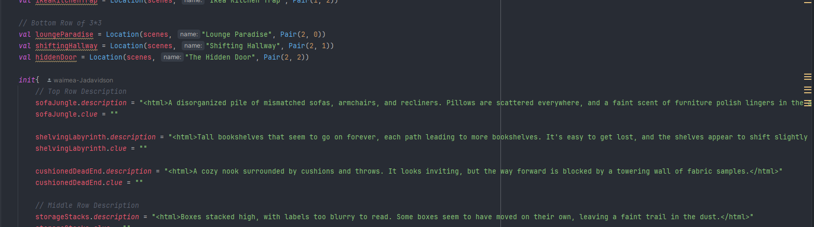
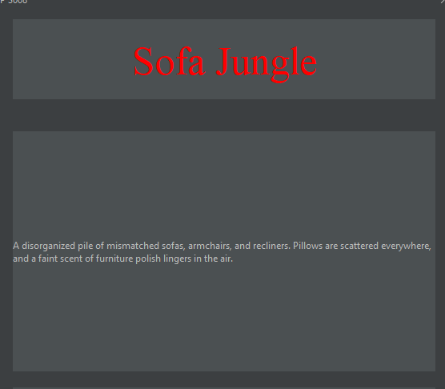

# Development Log

The development log captures key moments in your application development:

- **Design ideas / notes** for features, UI, etc.
- **Key features** completed and working
- **Interesting bugs** and how you overcame them
- **Significant changes** to your design
- Etc.

---

## Date: xx/xx/20xx

Example description and notes. Example description and notes. Example description and notes. Example description and notes. Example description and notes. Example description and notes.


---

## Date: 28/03/2025

This is what I have done to date, before we got the development log. It has buttons, labels etc


---

## Date: 28/03/2025

This is a screenshot of the intial player movement around the map


---

## Date: 1/04/2025

Improved movement system with error checking to prevent out of map occurrence. The movement has been incorporated into the function ```playerMovement()```.
This keeps the coder safer as it's stored in the app instead of the view.


---

## Date: 2/04/2025

I have taken inspiration from James on how he has done his scenes, I found my current method to be very cluttered.
By using this I can make my code easier and clear to read and debug later on.


---

## Date: 8/04/2025

### Clues Update

I have added clues, a clue screen and now the gameplay revolves around this feature to naviagte through the map.







---

## Date: 8/04/2025

### Scene Improvements

I have improved on my scenes.kt file and fixed a bug where scenes were storing into one list and overwriting each other.
This was causing a bug where switching between two levels became impossible and you would get stuck.








--- 


